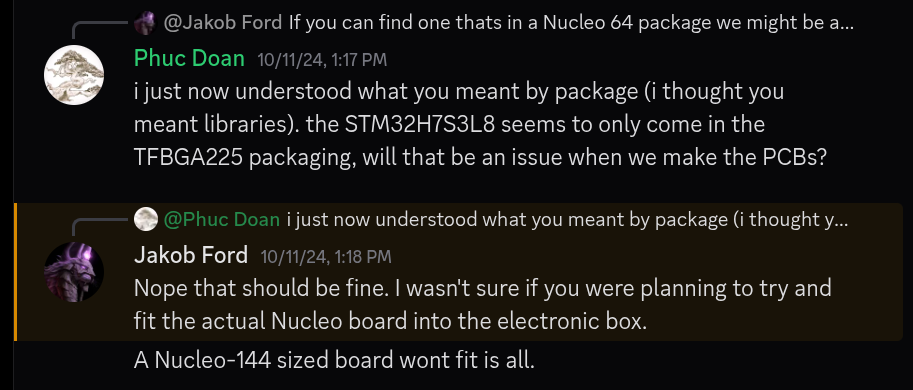
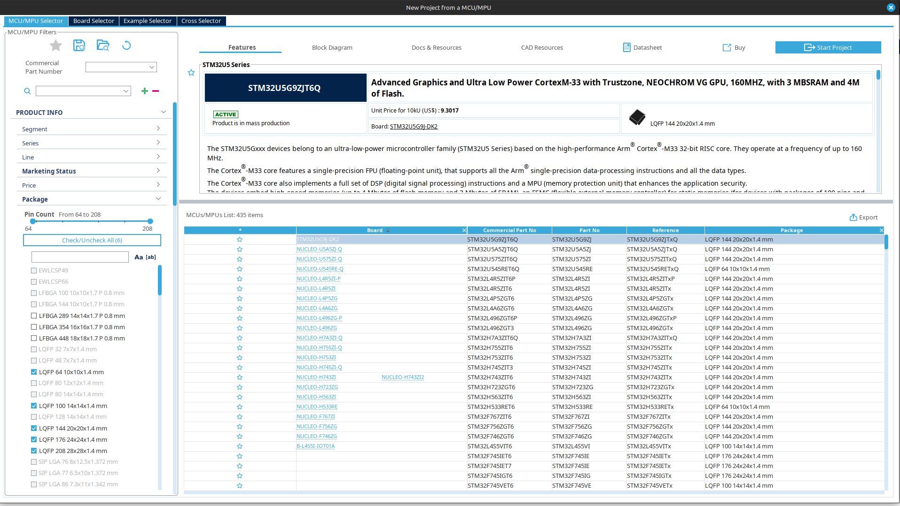
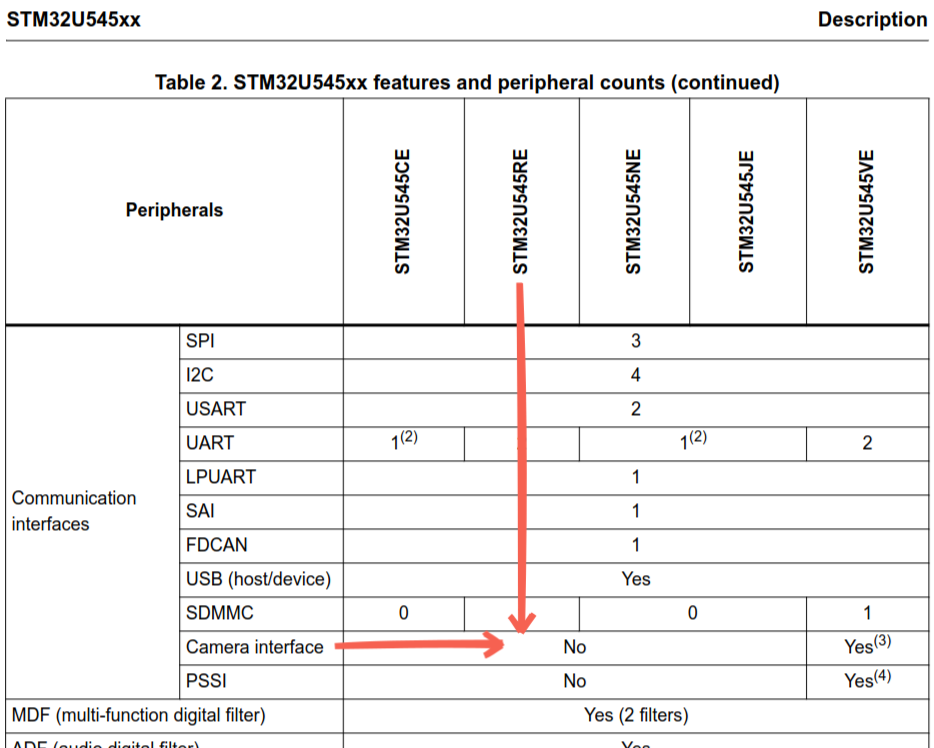
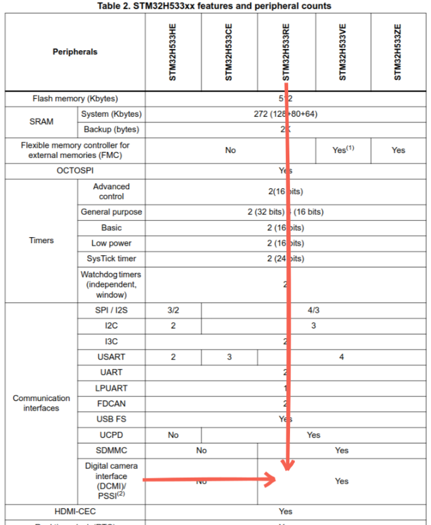
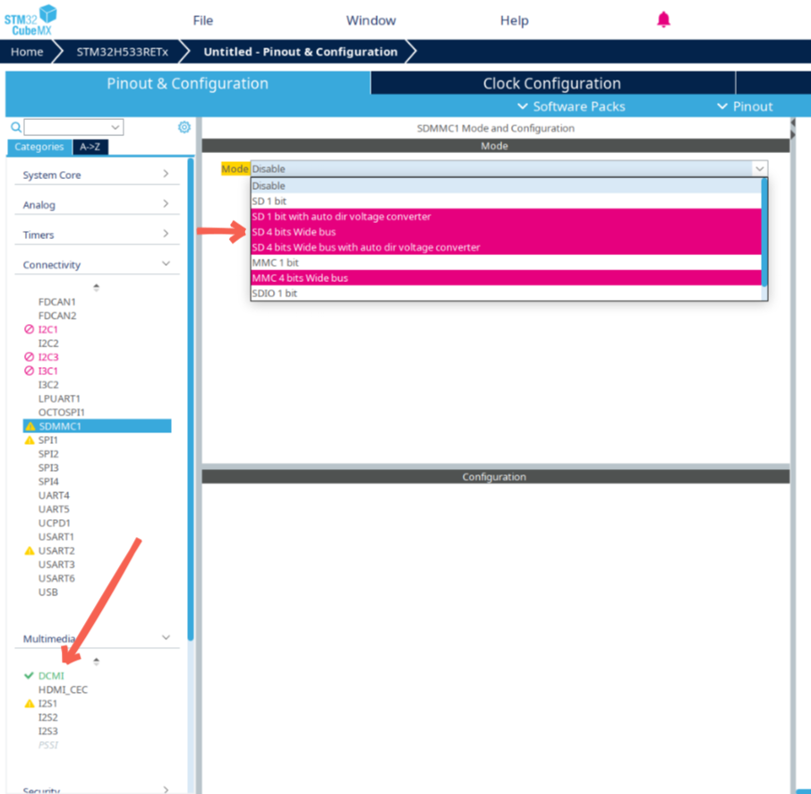

# Documentation.

This file serves as a technical reference manual of the RSXVT2026 experiment.
Here,
we will detail design decisions that were made,
why they were made,
and the things that could've been differently.
Note that the content in this document will electrical-heavy,
as I, Phuc Doan, am the main author.

&nbsp;

# Primary Microcontroller.

One of the earliest design decisions made for the project
was the primary MCU to be used throughout the experiment.

Given I already had in-depth experience with ST branded microcontrollers,
it's natural to choose an ST MCU,
but for completeness, there are other options too.

- **"Arduino" MCUs**.
These would be
[Arduino Uno](https://store-usa.arduino.cc/products/arduino-uno-rev3),
[Arduino Mega 2560](https://store-usa.arduino.cc/products/arduino-mega-2560-rev3),
[Arduino Nano](https://store-usa.arduino.cc/products/arduino-nano),
and other clones at play.
I put "Arduino" in scare-quotes because there's nothing special about these boards I linked.
The actual microcontroller at play here are the ATmega series MCUs.
The Arduino Uno and Arduino Nano boards use the ATmega328P MCU
while the Arduino Mega 2560 uses the ATmega2560.
The boards themselves are just hardware in order to support the MCU
like voltage regulators,
capacitors,
clock sources,
LEDs,
push buttons,
and so on.
In the context of the project,
having a prebuilt development board is great for getting things started,
but is a very heavy constraint on the final design of the experiment
in terms of volume and flexibility.
As for ATmega MCUs themselves,
they are not particularly known for being high performance;
there are probably good options out there,
but I wouldn't be familiar with them. 

- **Raspberry Pi's**.
These are in similar vein to Arduinos, but much beefier in terms of performance and capabilities.
The [Raspberry Pi Pico](https://www.raspberrypi.com/products/raspberry-pi-pico/)
is analogous to the Arduino Nano,
and the [Raspberry Pi 1](https://www.raspberrypi.com/products/raspberry-pi-1-model-b-plus/)
is analogous to the Arduino Mega 2560.
I've never worked with Raspberry Pi's before,
so I cannot speak much on the development experience
other than the fact that they've been proven to be
capable of running servers and computer vision processing.
What I can confidently say, however,
is that if a Raspberry Pi is used,
it'll almost certainly be through a development board
rather than a custom PCB.
In the case of Arduinos,
it's the simple ATmega MCU that's important,
so a custom flight computer PCB can designed around that,
but the Raspberry Pi brand offers only two microcontroller options:
[RP2350](https://www.raspberrypi.com/documentation/microcontrollers/microcontroller-chips.html#rp2350)
and [RP2040](https://www.raspberrypi.com/documentation/microcontrollers/microcontroller-chips.html#rp2040).
While a custom flight computer PCB can certainly designed with these two Raspberry Pi MCUs,
I've never done it before,
and it'd also seem to be the case for other RockSat teams.
Another issue with Raspberry Pi's is that
they sometimes seem to be slightly overpowered for their actual usage;
I've heard other RockSat teams talk about having to manage operating systems
for their Raspberry Pi boards,
and such a thing seems quite unnecessary and complicated for most missions.

- **ESP32s**.
One particular example would be the [XIAO ESP32-S3](https://www.seeedstudio.com/XIAO-ESP32S3-p-5627.html).
This board was flown for the 2024-2025 experiment,
so we already have an existing relationship with it.
While the XIAO ESP32-S3 would not be good as a flight computer due to the lack of available GPIOs,
other small footprint development boards based on the ESP microcontroller exist.
The best thing about ESP32s is that they are known for their RF hardware support,
having features to handle WiFi and Bluetooth.
The worst thing about the ESP32s is their development environment;
it's painfully slow to program them,
so having it be the primary MCU would be an absolute productivity killer.

The nice thing about ST branded microcontrollers is
that there are thousands of different models to choose from.
Each MCU model comes with a particular set of flash size,
GPIO count, physical packaging, peripherals, and so on.
Thus certainly there'd be a specific ST microcontroller
that'd have all of the necessary features needed for our experiment.

To narrow down the list of thousands of possible options,
we apply several constraints.

1. **Must have an associated develoment board.**
Without a development board to work on the chosen microcontroller,
flight software cannot be written until a PCB using that MCU has been made.
Thus practically no software work can be done until then,
but more importantly it'd would put us in a hairy predicament if our choice of MCU is poor
or if there was an issue with the PCB.
Using a different development board as a substitute for a entirely different MCU model
will not always work out,
as every MCU model as their own slight caveats and issues.
Code reuse is not so simple.

2. **Must support camera modules.**
It was also known that we'd need a microcontroller
that can directly interface with a camera module
(e.g. [OV5640](https://www.adafruit.com/product/5673))
so we could have a camera system for our experiment.
This means the MCU has the necessary peripherals
to handle the 8-bit data bus and synchronization signals coming from the camera.
It should be noted that we'd be directly communicating with the camera module
and not through a "middle-man controller"
(e.g. [ArduCam-Mini](https://botland.store/arduino-rpi-cameras/6556-arducam-mini-ov2640-2mpx-1600x1200px-60fps-spi-camera-module-for-arduino-5904422358242.html)).
A middle-man controller would be communicating with the camera module directly,
capturing and saving images,
and then transferring the images over to the actual ST MCU through an interface such as SPI,
but this is needlessly complicated and introduces unnecessary overhead.

3.  **Must support SD cards.**
Having an ST MCU that can directly communicate with an SD card is very useful,
either because it'll be the primary way of saving recorded flight data or just for logging purposes.
Once again, it's important that there aren't any "middle-man controllers" involved,
such as any
[uSD Card module with a SPI converter](https://www.amazon.com/HiLetgo-Adater-Interface-Conversion-Arduino/dp/B07BJ2P6X6/ref=sr_1_3)
that are often used by other RockSat teams.
Specifically,
data transfers done with an SD card via SPI is limited to a 1-bit bus with a clock speed of at *best* 25MHz,
but directly communicating with the SD card can be done with a 4-bit bus (thus 4x faster)
with better reliability because there being less hardware involved.

4. **Must be easy to solder.**
The easiest MCU package to solder would be any
[Quad-Flat-Package (QFP)](https://en.wikipedia.org/wiki/Quad_flat_package) variant;
the only thing easier than this would be a through-hole MCU,
but that'd be physically impractical given the previous stated constraints.
A harder package to work with would be any
[Quad Flat No-Leads (QFN)](https://en.wikipedia.org/wiki/Flat_no-leads_package)
variant;
these are similar to QFP but there are no legs,
thus detecting a bridge is more difficult because it could well be under the chip.
The MCU package we can _**absolutely not**_ work with is the
[Ball Grid Array (BGA)](https://en.wikipedia.org/wiki/Ball_grid_array);
designing and manufacturing a PCB with a BGA footprint is more demaning and potentially more expensive,
and soldering is practically impossible without an industrial X-ray to verify that there are no bridges.

<kbd>

 
 
<em>
"Nope that should be fine."  
It was not.
</em>
 
 

&nbsp;

5. **Must be the same MCU everywhere.**
Rather than having a specific MCU for the main camera systems,
a different one for the main flight computer,
and another one for the vehicle flight computer,
all of those systems should use the exact same MCU model.
This makes software development vastly simplier as things are much more portable,
but this also means we might need to find an MCU
that has support for camera modules even if that MCU would never actually work with a camera
(e.g. the flight computer MCU).

The first constraint narrows things quite a bit
as there are only so many development boards by ST that are available,
although there's still quite a bit.
The development boards of interest are the [*Nucleo*](https://www.st.com/en/evaluation-tools/stm32-nucleo-boards.html) branded ones;
other fancier development boards by ST exist,
but they're much more expensive and overkill for what we'd need.
The Nucleo boards primarily come in three sizes: 32, 64, and 144.
The number refers to the pin count of the onboard MCU.
Because 32-pin MCUs are so small,
none will have support for camera modules and SD cards,
hence we can entirely ignore Nucleo-32s.

To narrow down the list of Nucleo-64s and Nucleo-144s even further,
the vendor application [STM32CubeMX](https://www.st.com/en/development-tools/stm32cubemx.html)
is useful for searching across the thousands of STM32 MCUs available with specific filters.
We can filter for STM32 MCUs that have support for camera modules and SD cards,
is actively being manufactured,
have a package that is easy to solder,
and so on.
It'll also display whether or not there's a development board associated with it.

<kbd>

 
 
<em>
STM32CubeMX with filters on the left and list of MCUs on the right.
</em>
 
 

&nbsp;

Of the STM32 MCUs that have an associated Nucleo board,
we reduce it further by applying additional constraints:
- Nucleo board must be in stock and active production.
- Nucleo board's unit cost no greater than $30.
- MCU's unit cost no greater than $10.

| Development Board | MCU               | Package               | Verdict                 |
| :-:               | :-:               | :-:                   | :-                      |
| NUCLEO-F746ZG     | STM32F746ZGT6     | LQFP 144 20x20x1.4 mm | :x: Board obsolete.     |
| NUCLEO-F756ZG     | STM32F756ZGT6     | LQFP 144 20x20x1.4 mm | :x: Board costs $34.39. |
| NUCLEO-F767ZI     | STM32F767ZIT6     | LQFP 144 20x20x1.4 mm | :x: Board costs $34.39. |
| NUCLEO-H563ZI     | STM32H563ZIT6     | LQFP 144 20x20x1.4 mm | :x: Board costs $43.50. |
| NUCLEO-H723ZG     | STM32H723ZGT6     | LQFP 144 20x20x1.4 mm | :x: Board costs $40.81. |
| NUCLEO-H743ZI     | STM32H743ZIT6     | LQFP 144 20x20x1.4 mm | :x: Board obsolete.     |
| NUCLEO-H745ZI-Q   | STM32H745ZIT3     | LQFP 144 20x20x1.4 mm | :x: Board obsolete.     |
| NUCLEO-H753ZI     | STM32H753ZIT6     | LQFP 144 20x20x1.4 mm | :x: Board costs $40.81. |
| NUCLEO-H755ZI-Q   | STM32H755ZIT6     | LQFP 144 20x20x1.4 mm | :x: Board costs $41.06. |
| NUCLEO-H7A3ZI-Q   | STM32H7A3ZIT6Q    | LQFP 144 20x20x1.4 mm | :x: Board costs $40.94. |
| NUCLEO-L496ZG     | STM32L496ZGT3     | LQFP 144 20x20x1.4 mm | :x: MCU costs $13.89.   |
| NUCLEO-L496ZG-P   | STM32L496ZGT6P    | LQFP 144 20x20x1.4 mm | :x: MCU costs $12.23.   |
| NUCLEO-L4A6ZG     | STM32L4A6ZGT6     | LQFP 144 20x20x1.4 mm | :x: MCU costs $12.47.   |
| NUCLEO-L4P5ZG     | STM32L4P5ZGT6     | LQFP 144 20x20x1.4 mm | :x: Board costs $33.10. |
| NUCLEO-L4R5ZI     | STM32L4R5ZIT6     | LQFP 144 20x20x1.4 mm | :x: Board costs $33.10. |
| NUCLEO-L4R5ZI-P   | STM32L4R5ZIT6P    | LQFP 144 20x20x1.4 mm | :x: Board costs $33.10. |
| NUCLEO-U575ZI-Q   | STM32U575ZIT6Q    | LQFP 144 20x20x1.4 mm | :x: MCU costs $11.31.   |
| NUCLEO-U5A5ZJ-Q   | STM32U5A5ZJT6Q    | LQFP 144 20x20x1.4 mm | :x: Board costs $39.53. |
| NUCLEO-H533RE     | STM32H533RET6     | LQFP 64 10x10x1.4 mm  |                         |
| NUCLEO-U545RE-Q   | STM32U545RET6Q    | LQFP 64 10x10x1.4 mm  |                         |

This leaves us with two options, STM32H533RET6 and STM32U545RET6Q,
but as it turns out,
the latter STM32U545RET6Q does not have a camera interface
despite us applying the filter for it in STM32CubeMX (this is probably a database misentry).
Careful reading of the MCU's datasheet
([DS14216](https://www.st.com/resource/en/datasheet/stm32u545ce.pdf))
reveals this.

<kbd>

 
 
<em>
The camera interface is only supported on the STM32U545VE.
</em>
 
 

&nbsp;

The other STM32H533RET6 luckily does actually support the camera interface,
as indicated by [DS1416](https://www.st.com/resource/en/datasheet/stm32h533ce.pdf).

<kbd>

 
 
<em>
The camera interface is supported on the STM32H533RE.
</em>
 
 

&nbsp;

This leaves us with the only one option of our primary MCU: STM32H533RET6.
However, there's another issue,
and that being the MCU does not have enough pin-outs to support 
the camera interface and an SD card with a 4-bit bus *simultaneously*.
This can be seen in STM32CubeMX when trying to configure the MCU.

<kbd>

 
 
<em>
The camera interface (DCMI) takes up pins that the  
SD card interface (SDMMC) would otherwise use.
</em>
 
 

&nbsp;

Typically this would mean we'd either have to accept this
and use the SD card interface with a 1-bit bus
(killing our throughput performance)
or we relax our pricing constraints so we have more MCU options.
Luckily, however,
we can still "use" the STM32H533RET6
if we instead substitute it with the higher pin-out model STM32H533VET6.
The difference in the naming of the commerical part numbers here is the `R` and the `V`.
The `R` in STM32H533**R**ET6 denotes that the MCU has 64 pins,
while the `V` in STM32H533**V**ET6 denotes that the MCU has 100 pins;
this is just the [naming convention](https://www.digikey.com/en/maker/tutorials/2020/understanding-stm32-naming-conventions)
that ST uses to organize their thousands of MCUs.

Because the STM32H533VET6 has more available pins,
it's possible to use both the camera interface and the 4-bit SD card interface at the same time
without any conflicts.
The only wrinkle here is that the Nucleo-H533RE uses the 64-pin STM32H533RET6,
so when we make our PCBs, we'd need to use the 100-pin STM32H533VET6.
This is not too much of an issue, however,
because these two MCUs are similar enough that they refer to the same reference manual ([RM0481](https://www.st.com/resource/en/reference_manual/rm0481-stm32h52333xx-stm32h56263xx-and-stm32h573xx-armbased-32bit-mcus-stmicroelectronics.pdf)),
so code is still portable between the two.
Additionally, the Nucleo boards are only used for development purposes,
e.g. writing drivers for the camera interface and the SD card interface.
It won't be possible to work with the camera interface and SD card interface
at the same time on the Nucle-H533RE,
but the chances of there being an issue with the two drivers integrated together is unlikely.
Overall, this is an acceptable compromise.

One final important consideration to account for is the market conditions of the Nucleo board and MCU.
As of writing, the Nucleo-H533RE is priced at $26.64 per unit with 966 in stock at DigiKey;
on the more expensive end but these development boards are mostly a one-time purchase.
For the 100-pin STM32H533VET6, they're priced at $6.04 per unit with 447 in stock at DigiKey.
The MCU themselves are quite cheap compared to the other similar MCUs available
where they're typically at least $10 per unit.
The stocking of the development boards and MCUs are not too low,
so chances of them being out of stock right when we need them the most is unlikely,
although it is still possible.

All in all,
that concludes the thought process on
why I've chosen the STM32H533VET6 as our primary MCU to be used throughout our experiment.
Careful consideration of features, capabilities, and market conditions
is what has allowed us to use an MCU that's most fit for our application.
After having programmed and designed PCBs around the STM32H533VET6 dozens of times,
there is nothing better I could've replaced it with or done differently.

&nbsp;

# Development Environment.

> [!CAUTION]
> Incomplete.

&nbsp;

# Build System.

> [!CAUTION]
> Incomplete.

&nbsp;

# KiCad.

> [!CAUTION]
> Incomplete.

&nbsp;

# Burn-Wire.

> [!CAUTION]
> Incomplete.

&nbsp;

# Vehicle Avionics.

> [!CAUTION]
> Incomplete.

&nbsp;

# Main Camera System.

> [!CAUTION]
> Incomplete.

# Debug Board.

> [!CAUTION]
> Incomplete.

&nbsp;

# ST-Link Shield.

> [!CAUTION]
> Incomplete.

&nbsp;

# RF Communication.

> [!CAUTION]
> Incomplete.

&nbsp;

# Vehicle Interface.

> [!CAUTION]
> Incomplete.

&nbsp;

# Debug Board.

> [!CAUTION]
> Incomplete.

&nbsp;

# Power Distribution System.

> [!CAUTION]
> Incomplete.