# Virginia Tech RockSat-X 2026 Project.

> [!IMPORTANT]
> [Please check out the wiki!](https://github.com/RockSat-X/RSXVT2026/wiki)

# Mission Overview.

> [!CAUTION]
> Incomplete.

# System Overview.

> [!CAUTION]
> Incomplete.

<kbd>

 
 
<em>Labeled CAD model of the experiment.</em>
 
 
</kbd>

&nbsp;

## Main Camera System.

The experiment has two Main Camera Systems:
one placed before the ejection mechnism
and one next to a Solarboard by the burn-wire mechanism.

<kbd>

 
 
<em>Main Camera System demonstration.</em>
 
 
</kbd>

&nbsp;

The Main Camera System board has a single RGB LED.

| Color          | Description                                                                                          |
| :------------: | ---------------------------------------------------------------------------------------------------- |
| White          | Reformatting uSD card. |
| Magenta        | Initializing uSD card. |
| Blue           | Initializing OV5640 camera module. |
| Toggling green | Recording successfully. |
| Red            | Main Camera System resetting. |

&nbsp;

The Main Camera System creates a binary blob file for each recording.
Use `cli.py parseVideo` to convert the binary blob file into an MP4 video.

&nbsp;

## Debug Board.

The Debug Board has a display to indicate the status of subsystems
from the perspective of the Main Flight Computer.
When the experiment is powered on via GSE-1,
the Debug Board will initialize and play the Nokia buzzer tune.
The display will also periodically invert color;
this is just to indicate that the Debug Board MCU is still running.

<kbd>

 
 
<em>Debug board demonstration.</em>
 
 
</kbd>

&nbsp;

The Debug Board displays the following information.

| Field     | Description                                                                                          |
| :-------: | ---------------------------------------------------------------------------------------------------- |
| `DB-T`    | Time elapsed since the debug board was powered on.                                                   |
| `MFC-T`   | Time elapsed since the Main Flight Compiuter was powered on.                                         |
| `SCB-A`   | Voltage of SB-SCA.                                                                |
| `SCB-B`   | Voltage of HP-SCA.                                                                |
| `te1`     | Whether or not Main Flight Computer is detecting TE-1.                                               |
| `vehicle` | Whether or not Main Flight Computer is communicating with the Vehicle Flight Computer through the vehicle interface. |
| `esp32`   | Whether or not Main Flight Computer is receiving ESP-NOW data packets.                               |
| `lora`    | Whether or not Main Flight Computer is receiving LoRa data packets.                                  |
| `logger`  | Whether or not Main Flight Computer is saving data to its uSD card.                                  |

If the Debug Board has not received the first debug packet from the Main Flight Computer yet,
then the field values will either be `???` or `nan` to indicate this.

> [!IMPORTANT]
> A known issue with the Debug Board's display is that it is not resettable.
> That is, if the Debug Board MCU has a communication issue with the display driver,
> there's a small possibility that the display ends up in a corrupted state.
> This may appear as the screen being darker, the resolution looking off,
> or is completely blank.
> The MCU has no way to fix this,
> but power-cycling will resolve this rare issue if it ever happens.

&nbsp;

The debug board has four RGB LEDs.

| Label     | Position     | Description                                                                                          |
| :-------: | :----------: | ---------------------------------------------------------------------------------------------------- |
| `A`       | Top Right    | Flashes colors when the buzzer is being driven; this is just an extra indicator that's useful for when the buzzer is mute. |
| `B`       | Top Left     | White when the Main Flight Computer hasn't sent the first debug packet to the Debug Board yet; red when there's a bad status to be aware of such as the Main Flight Computer not having received RF data in a while. |
| `C`       | Bottom Right | Toggles red when the Main Flight Computer hasn't sent a debug packet in a while; toggles green when a debug packet has been received. |
| `D`       | Bottom Left  | White when the uSD card is being formatted; magenta when the Debug Board is failing to initialize the uSD card; toggles green periodically when data is successfully being logged to the uSD card. |

> [!IMPORTANT]
> If the Debug Board encounters an irrecoverable error,
> it'll panic and indicate this by flashing all LEDs red.
> The Debug Board should eventually reset itself and continue on as normal.

&nbsp;

The debug board plays the following buzzer tunes.

| Tune                                        | Description                                                                    |
| :---------:                                 | ------------------------------------------------------------------------------ |
| [Nokia      ](./misc/media/nokia.wav      ) | Debug Board is initializing (e.g. just powered on from GSE-1). |
| [Hazard     ](./misc/media/hazard.wav     ) | Debug Board hasn't received a debug packet from the Main Flight Computer in a while. |
| [Up and Down](./misc/media/up_and_down.wav) | `te1` is active (i.e. burn-wire is going). |
| [Deep Beep  ](./misc/media/deep_beep.wav  ) | Main Flight Computer is reporting a bad status (e.g. haven't received RF data in a while) |
| [Tetris     ](./misc/media/tetris.wave    ) | The Debug Board's uSD card is being reformatted. |

To mute the buzzer, leave the header above the buzzer open.
To enable the buzzer, have a jumper shorting two adjacent pins;
which pins are shorted determines the volume of the buzzer.

&nbsp;

The uSD card is optional to the operation of the Debug Board.
The Debug Board uses LED D to indicate that it's successfully saving log data.

<kbd>

 
 
<em>
To load a uSD card, lift the connector lid up,
 
place the uSD card,
and slide the lid down to secure it.
</em>
 
 
</kbd>

&nbsp;

<kbd>
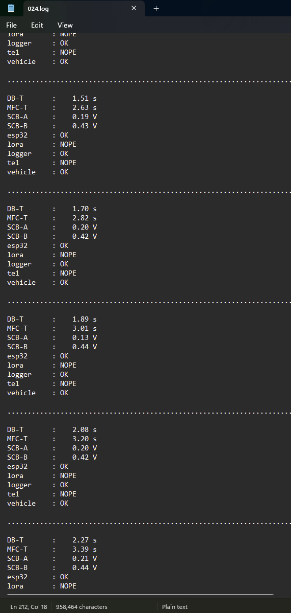
 
 
<em>
The Debug Board creates an ASCII text file with  
the same information displayed on its screen.
</em>
 
 
</kbd>

&nbsp;

## Vehicle Flight Computer.

The following table details the corresponding buzzer tune and RGB LED behavior for when a Vehicle Flight Computer diagnostic is reported.

| Severity | Tune                                              | RGB LED                 | Description                                                                                          |
|:-:| :-----------------------------------------------: | :-----------------: | ---------------------------------------------------------------------------------------------------- |
| :bangbang:         | [Ambulance  ](./misc/media/ambulance.wav      )   | Fast toggling red   | TMC2209 stepper motor drivers are failing initialization. This could be due to bad ribbon cable connection, dead batteries, inhibited batteries, or something else. |
| :warning:          | [Heartbeat  ](./misc/media/heartbeat.wav      )   | Slow toggling red   | Vehicle Flight Computer has saturated a motor's RPM velocity. |
| :warning:          | [Tetris     ](./misc/media/tetris.wav         )   | Slow toggling white | Vehicle Flight Computer is reformatting the uSD card. |
| :warning:          | [Mario      ](./misc/media/mario.wav          )   | Fast toggling white | Resetting the Vehicle ESP32 due to an issue with it. |
| :warning:          | [Three Tone ](./misc/media/three_tone.wav     )   | Fast toggling white | Resetting the Vehicle OpenMV due to an issue with it. |
| :bangbang:         | [Hazard     ](./misc/media/hazard.wav         )   | Fast toggling blue  | Communication issue with VN-100. |
| :white_check_mark: | [Nokia      ](./misc/media/nokia.wav          )   | Slow toggling white | Vehicle Flight Computer detecting that the vehicle has been redocked. |
| :white_check_mark: | [Birthday   ](./misc/media/birthday.wav       )   | Slow toggling white | Vehicle Flight Computer detecting that the vehicle has been ejected. |
| :warning:          | [Heavy Beep ](./misc/media/heavy_beep.wav     )   | Toggling magenta    | Initialization issue with uSD card. This is okay if no uSD card is loaded. |
| :white_check_mark: | [Burp       ](./misc/media/burp.wav           )   | Blue blink          | VN-100 communication okay. |
| :white_check_mark: | [Chirp      ](./misc/media/chirp.wav          )   | Green blink         | uSD card logging okay. |
| :white_check_mark: | [Waking Up  ](./misc/media/waking_up.wav      )   | None                | Vehicle Flight Computer initializing (i.e. on activation of GSE-1); vehicle batteries are enabled at end of buzzer tune. |
| :white_check_mark: | [Star Wars  ](./misc/media/starwars.wav       )   | None                | Vehicle Flight Computer performing a dock shutdown (i.e. about to turn vehicle batteries off and resetting). |

| Severity            | Description                                                                                          |
| :-----------------: | ---------------------------------------------------------------------------------------------------- |
| :bangbang:  | Something is likely very problematic and should be addressed as soon as possible. |
| :warning:  | A non-fatal or recoverable issue. |
| :white_check_mark:  | Positive or expected indicator of a working system. |

The three pin header on the Vehicle Flight Computer can be left open to mute the buzzer,
otherwise short a pair of adjacent pins to determine the volume of the buzzer.

&nbsp;

The Vehicle Flight Computer board also has an optional uSD card slot for log data.

<kbd>
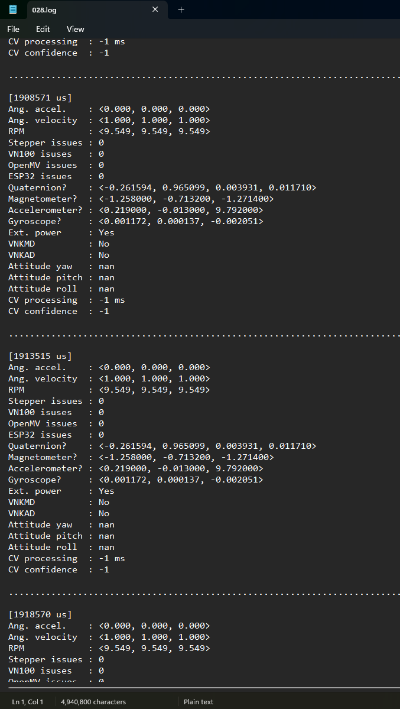
 
 
<em>
The Vehicle Flight Computer creates an ASCII text file with information  
like VN-100 IMU data, CVT results, current motor velocities, and so on.
</em>
 
 
</kbd>

&nbsp;

&nbsp;

## OpenMV H7+.

The OpenMV H7+ has a single RGB LED.

| RGB LED             | Description                                                                                          |
| :-----------------: | ---------------------------------------------------------------------------------------------------- |
| Flashing blue       | The CVT algorithm hasn't detected the horizon yet. |
| Flashing green      | The CVT algorithm has found the horizon. |

Each toggle of the RGB LED represents an entire image being captured, processed, and transmitted to the Vehicle Flight Computer.
Because JPEG image compression is used,
if the OpenMV H7+'s camera lens is covered (e.g. by a finger),
the blinking of the RGB LED will be much faster.

If the OpenMV H7+'s RGB LED is not blinking, then it's very likely the program is not running,
but the Vehicle Flight Computer should reset the OpenMV H7+ eventually after a time-out period.

No other colors or behavior should be expected from the RGB LED or the OpenMV H7+ module as a whole.

&nbsp;

## Vehicle Power Distribution System.

The Vehicle Power Distribution System has LED indicators to be aware of.

| LED                 | Description                                                                                          |
| :-----------------: | ---------------------------------------------------------------------------------------------------- |
| Bright white        | Vehicle interface providing power to the vehicle, thus this LED should be active if and only if the vehicle is docked and GSE-1 is active. |
| Yellow              | Vehicle Flight Computer has enabled on-board battery power. The LED should be off when the Vehicle Flight Computer is initializing but should eventually turn on, unless the vehicle battery inhibit is in place, to which this LED will never turn on. |

The Vehicle Power Distribution System has three jumpers to be aware of.

<kbd>
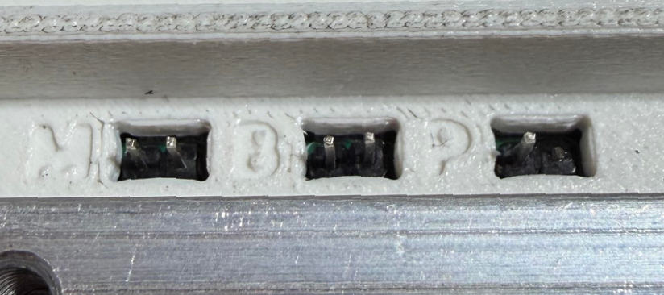
 
 
<em>
First jumper on the left denoted with "M" as in "Motor Inhibit".  
Second jumper in the middle denoted with "B" as in "Battery Inhibit".  
Third jumper on the right denoted with "P" as in "Power".  
Note that the third "Power" jumper should only have its  
first left pin and the second right pin is broken off.
</em>
 
 
</kbd>

&nbsp;

| Jumper              | Activation | Description |
| :-----------------: | - | - |
| "M"                 | Use a shorting 2-pin jumper with pull tab. | Disable the control of the stepper motors. Vehicle Flight Computer can still initialize and operate, but reaction wheels will not spin. This is used to conserve battery charge, if needed. |
| "B"                 | Use a shorting 2-pin jumper with pull tab. | Disable the usage of the vehicle batteries. Vehicle Flight Computer can still initialize and operate via external power through the vehicle interface (i.e. GSE-1), but will immediately unpower upon being undocked. This can also be used to turn off the vehicle manually. |
| "P"                 | Use jumper wire to connect the pin to one of the vehicle batteries' positive terminal and wait several seconds. | Forces the usage of vehicle battery power, thus the Vehicle Flight Computer will initialize. This is to turn the vehicle on without relying on external power. |

> [!TIP]
> A quick way to turn off the vehicle is by using an Allen key to short the middle "B" jumper.

&nbsp;

# Wallops Testing Procedure.

The following table summarizes the primary configurations needed to be set for tests done at Wallops.

| Expected Date                           | Test                         | Allow Ejection?    | Enable TE-1?       | Enable Main GSE-1? | Enable Vehicle GSE-1? |
| :-------------------------------------: | :--------------------------: | :-:                | :-:                | :-:                | :-:                   |
| May 17th, 2026; Sunday                  | Pre-Flight Seq.              | :white_check_mark: | :white_check_mark: | :white_check_mark: | :white_check_mark:    |
| May 18th-19th, 2026; Monday-Tuesday     | Pre-Vibe All-Fire Seq.       | :white_check_mark: | :white_check_mark: | :white_check_mark: | :white_check_mark:    |
| May 18th-19th, 2026; Monday-Tuesday     | Pre-Vibe No-Fire Seq.        | :x:                | :x:                | :white_check_mark: | :white_check_mark:    |
| May 19th, 2026; Tuesday                 | Pre-Vibe Back Up Seq.        | :x:                | :x:                | :white_check_mark: | :white_check_mark:    |
| May 20th-21st, 2026; Wednesday-Thursday | Vibration Testing            | :white_check_mark: | :white_check_mark: | :white_check_mark: | :white_check_mark:    |
| May 22nd, 2026; Friday                  | Post-Vibe All-Fire Seq.      | :white_check_mark: | :white_check_mark: | :white_check_mark: | :white_check_mark:    |
| May 22nd, 2026; Friday                  | Post-Vibe No-Fire Seq.       | :x:                | :x:                | :white_check_mark: | :white_check_mark:    |
| May 22nd, 2026; Friday                  | Post-Vibe Back Up Seq.       | :x:                | :x:                | :white_check_mark: | :white_check_mark:    |
| May 22nd, 2026; Friday                  | GPS Roll-Out                 | :x:                | :x:                | :white_check_mark: | :white_check_mark:    |
| June 19th, 2026; Friday                 | Final All-Fire Seq.          | :white_check_mark: | :white_check_mark: | :white_check_mark: | :white_check_mark:    |
| June 19th, 2026; Friday                 | Final No-Fire Seq.           | :x:                | :x:                | :white_check_mark: | :white_check_mark:    |
| June 19th, 2026; Friday                 | Final Back Up Seq.           | :x:                | :x:                | :white_check_mark: | :white_check_mark:    |

To allow ejection ( :white_check_mark: ),
ensure the mechanical inhibit in front of the ejection mechanism is removed.

To prevent ejection ( :x: ),
ensure the mechanical inhibit is secured in front of the ejection mechanism.

To have TE-1, Main GSE-1, or Vehicle GSE-1 be enabled ( :white_check_mark: ),
insert a screw into the corresponding electrical screw switch on the side of the ejection mechanism.
Verify short-circuit with a multimeter.

To have TE-1, Main GSE-1, or Vehicle GSE-1 be disabled ( :x: ),
ensure a screw is not inserted into the corresponding electrical screw switch.
Verify open-circuit with a multimeter.

> [!IMPORTANT]
> The experiment must be put into flight-ready configuration during vibration testing.
> This means all electrical screw switches should be enabled and no mechanical inhibit present.
> It should also be noted that Wallops will only provide GSE-1 and there will be no TE-1 power
> during this vibration test (this also applies to GPS Roll-Out).

> [!IMPORTANT]
> The purpose of the electrical screw switches for Main GSE-1 and Vehicle GSE-1 is for flexibility.
> In the event that we need to ensure that the main avionics and/or vehicle does not power on,
> we have these as a way to do so.

# Remove-Before-Flight Procedure.

The following steps are to be carried out in order with minimal deviations after all final sequence tests are done.

## 1. Ensure ejection inhibit is removed.

> [!CAUTION]
> Incomplete.

## 2. Replace vehicle batteries.

Go to the side of the vehicle where the batteries are stored.

<kbd>
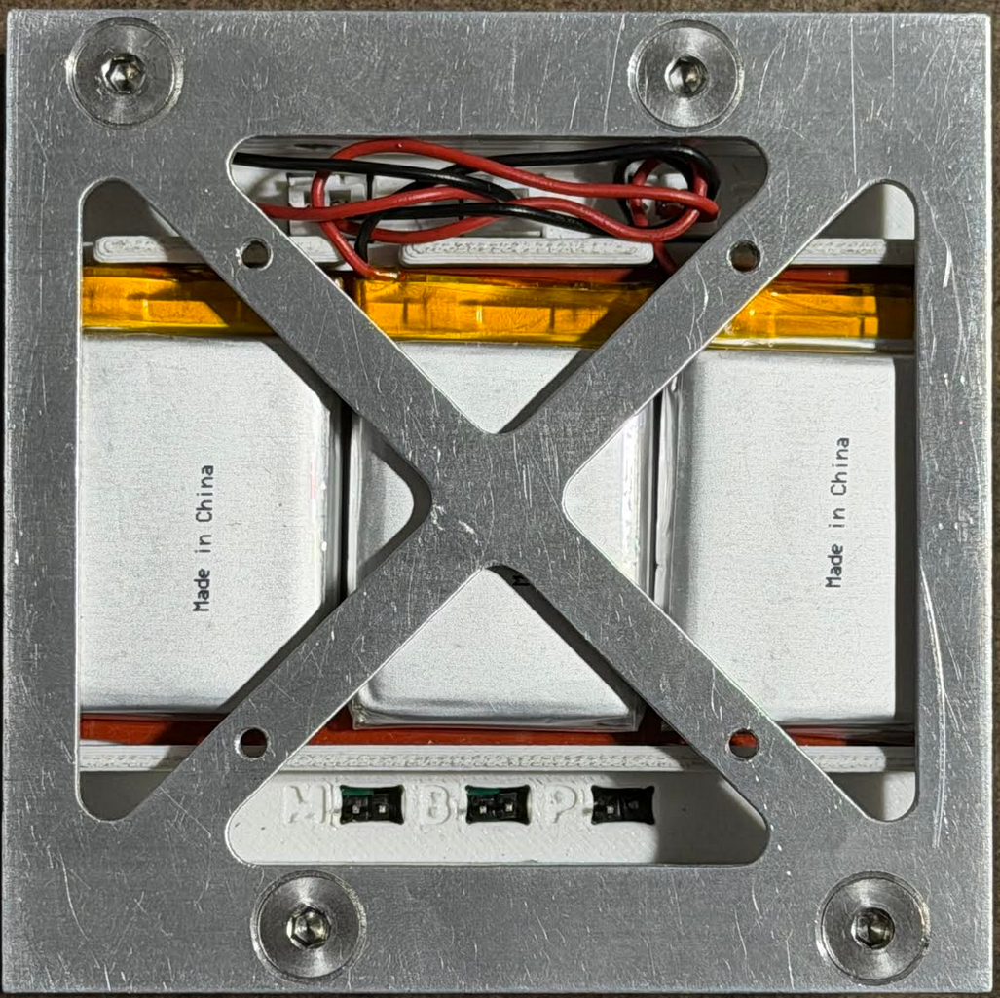
 
 
<em>
Side of the vehicle where the batteries are stored.
</em>
 
 
</kbd>

&nbsp;

Take off the panel.
Place the screws in a secure location.

<kbd>
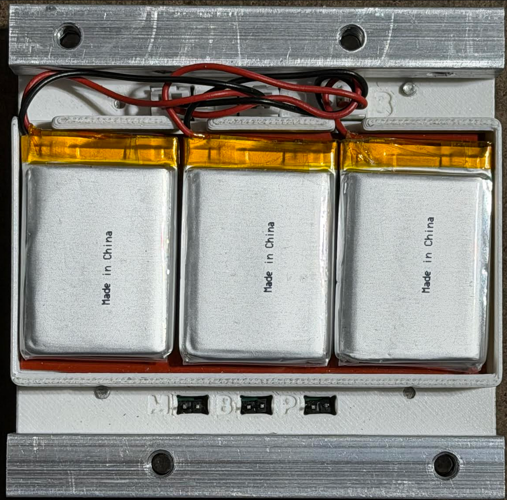
 
 
<em>
Panel that secured the vehicle's batteries removed.
</em>
 
 
</kbd>

&nbsp;

Take out the old vehicle batteries.
It is okay to tug on the cable to do so if excessive force is not used.
Make sure to place the old vehicle batteries somewhere secure so it will not be confused with the new batteries.

<kbd>
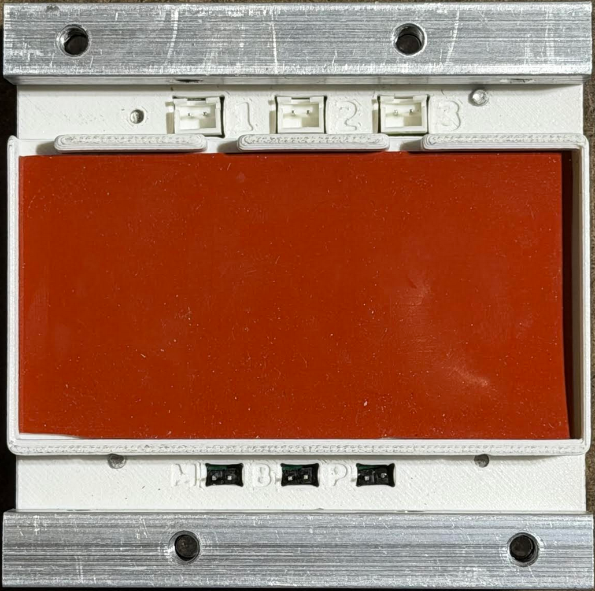
 
 
<em>
Vehicle batteries removed.
</em>
 
 
</kbd>

&nbsp;

Verify that the new batteries (EEMB LP653042 3.7V 820mAh) are fully charged.

<kbd>
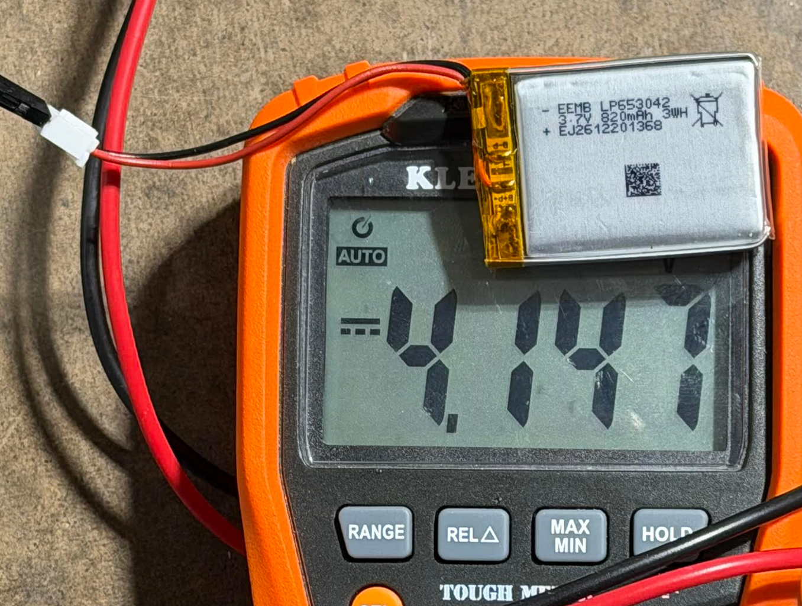
 
 
<em>
A fully charged vehicle battery should have at least 4V.
</em>
 
 
</kbd>

&nbsp;

Verify that the new batteries have a JST-XH plug of the correct polarity.

<kbd>
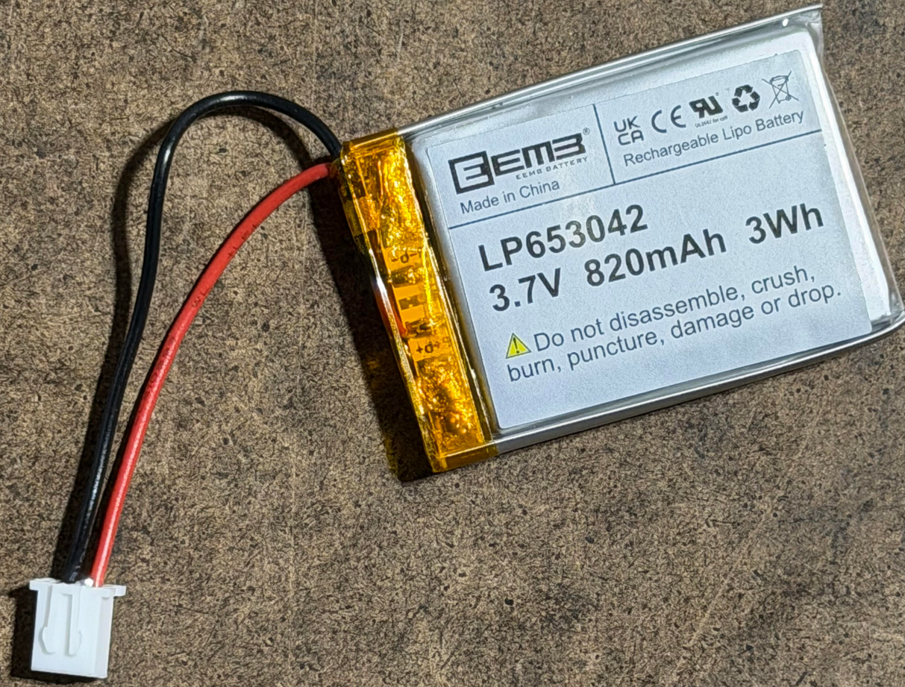
 
 
<em>
Note the plug polarity.
</em>
 
 
</kbd>

&nbsp;

Put in the new vehicle batteries.
The order in which the vehicle batteries are connected does not matter.
Ensure the cables are well tucked to prevent them being crushed by the panel.

<kbd>

 
 
<em>
Vehicle batteries replaced.
</em>
 
 
</kbd>

&nbsp;

Place and align the vehicle panel with the pillar's screw holes and verify
that the battery cables will not be crushed.

<kbd>
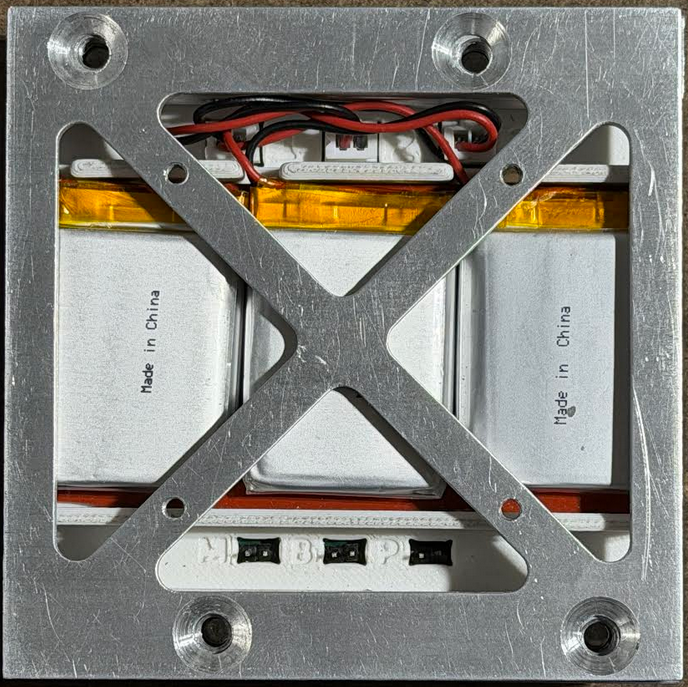
 
 
<em>
Vehicle panel aligned on top but not yet screwed.
</em>
 
 
</kbd>

<kbd>
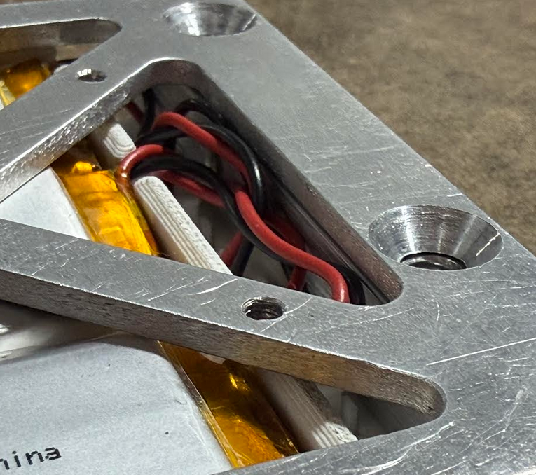
 
 
<em>
Battery cables tucked securely and not between the panel and pillar.
</em>
 
 
</kbd>

&nbsp;

Apply red Loctite to the threads and reinsert screws to secure the panel.

<kbd>

 
 
<em>
Side of the vehicle where the batteries are stored.
</em>
 
 
</kbd>

&nbsp;

> [!IMPORTANT]
> Summary: new batteries are put in and red Loctite has been applied.

## 3. Remove vehicle jumper inhibits.

Ensure the vehicle's jumpers for disabling motors, disabling batteries, and forcing vehicle power-on
are all open-circuit as depicted below.

<kbd>

 
 
<em>
Vehicle jumpers in flight configuration.
</em>
 
 
</kbd>

&nbsp;

## 4. Remove external uSD connector lids and jumpers.

To prevent vibration risks,
the Vehicle Flight Computer and Debug Board should have the lid of their uSD connectors be taken off.
The pin header for the buzzer should also be left as an open circuit.

<kbd>
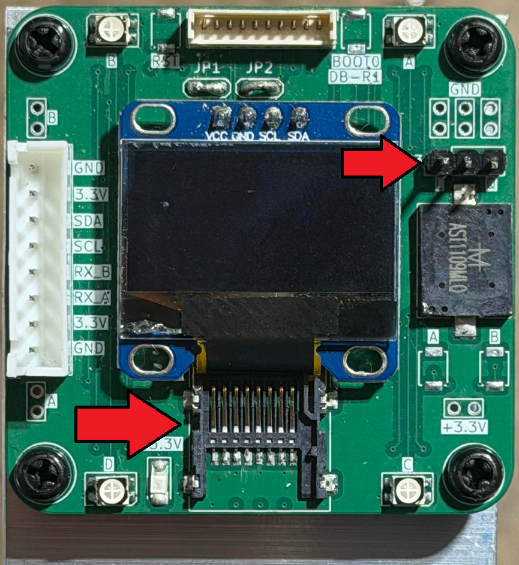
 
 
<em>
Debug Board without uSD card connector lid and buzzer jumper.
</em>
 
 
</kbd>

&nbsp;

<kbd>
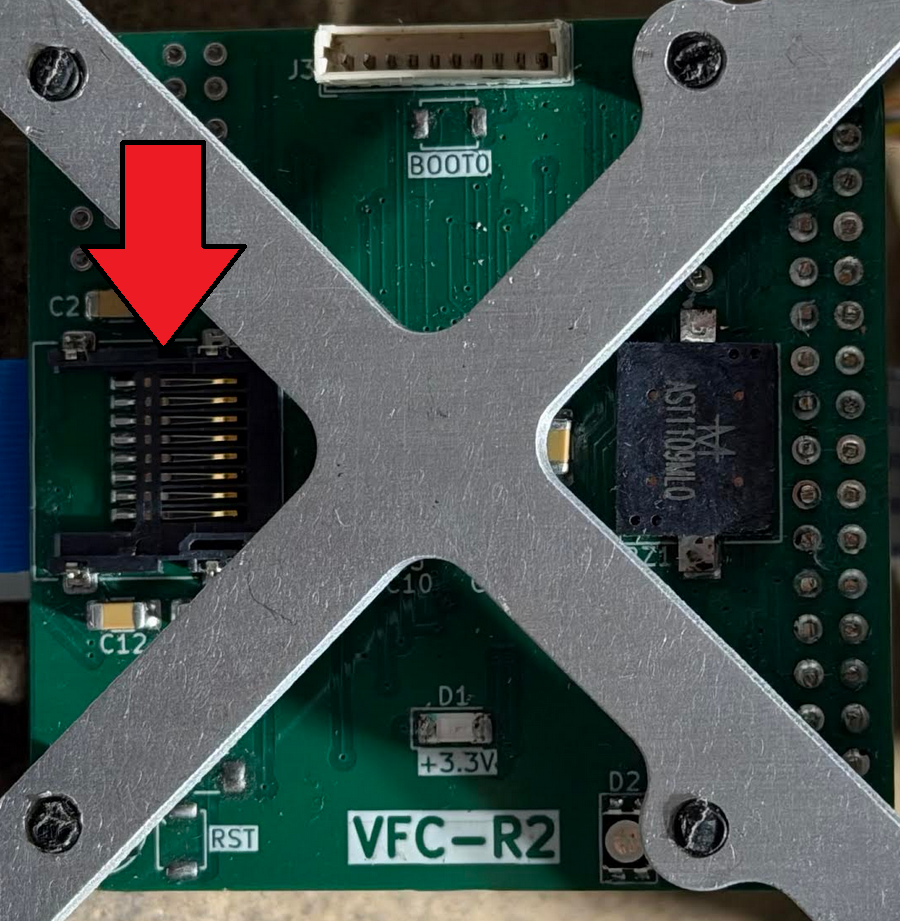
 
 
<em>
Vehicle Flight Computer without uSD card connector lid.
</em>
 
 
</kbd>

&nbsp;

<kbd>
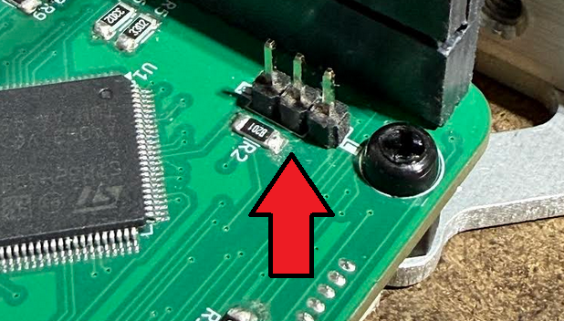
 
 
<em>
Vehicle Flight Computer without buzzer jumper.  
Tweezers might be needed.
</em>
 
 
</kbd>

&nbsp;

## 5. Insert screws into electrical screw switches.

> [!CAUTION]
> Incomplete.

## 6. Redock vehicle and set burn-wire mechanism.

> [!CAUTION]
> Incomplete.
