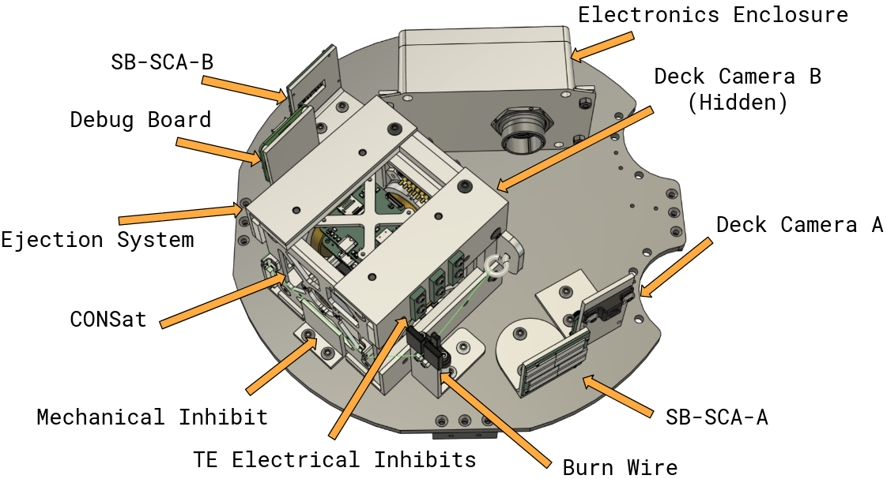
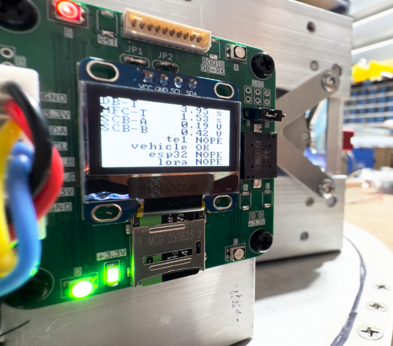
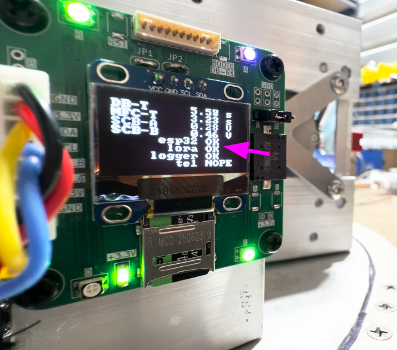

# Virginia Tech RockSat-X 2026 Project.

> [!IMPORTANT]
> [Please check out the wiki!](https://github.com/RockSat-X/RSXVT2026/wiki)

# Mission Overview.

> [!CAUTION]
> Incomplete.

# System Overview.

> [!CAUTION]
> Incomplete.

<kbd>

 
 
<em>Labeled CAD model of the experiment.</em>
 
 
</kbd>

&nbsp;

### Debug Board.

The debug board has a display to indicate the status of subsystems
from the perspective of the Main Flight Computer.
When the experiment is powered on via GSE-1,
debug board will initialize and plays *Nokia* buzzer tune.
The display will also periodically invert color;
this is just to indicate that the debug board MCU is still running.

<kbd>

 
 
<em>Debug board.</em>
 
 
</kbd>

&nbsp;

The debug board displays the following information.

| Field     | Description                                                                                          |
| :-------: | ---------------------------------------------------------------------------------------------------- |
| `DB-T`    | Time elapsed since the debug board has powered on.                                                   |
| `MFC-T`   | Time elapsed since the Main Flight Compiuter has powered on.                                         |
| `SCB-A`   | Voltage of SB-SCA (TODO: Fix naming).                                                                |
| `SCB-B`   | Voltage of HP-SCA (TODO: Fix naming).                                                                |
| `te1`     | Whether or not Main Flight Computer is detecting TE-1.                                               |
| `vehicle` | Whether or not Main Flight Computer is communicating with the vehicle through the vehicle interface. |
| `esp32`   | Whether or not Main Flight Computer is receiving ESP-NOW data packets.                               |
| `lora`    | Whether or not Main Flight Computer is receiving LoRa data packets.                                  |
| `logger`  | Whether or not Main Flight Computer is saving data to its uSD card.                                  |

<kbd>

 
 
<em>Debug board.</em>
 
 
</kbd>

&nbsp;

The debug board has four RGB LEDs:

| Label     | Position     | Description                                                                                          |
| :-------: | :----------: | ---------------------------------------------------------------------------------------------------- |
| `A`       | Top Right    | Flashes colors when buzzer is being driven; this is an extra indicator for when the buzzer is muted. |
| `B`       | Top Left     | White when Main Flight Computer hasn't sent a debug packet to the Debug Board yet; red when there's a bad condition. |
| `C`       | Bottom Right | Voltage of SB-SCA (TODO: Fix naming).                                                                |
| `D`       | Bottom Left  | Voltage of SB-SCA (TODO: Fix naming).                                                                |

# Wallops Testing Procedure.

> [!CAUTION]
> Incomplete.

# Remove-Before-Flight Procedure.

> [!CAUTION]
> Incomplete.